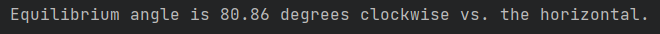

# Get the Hang of It

## What This Program Does

In short, this program tells you the angle that any given guitar will hang at from a standard guitar strap, and 
lets you see how virtual modifications affect that angle. If you've ever said the words "neck dive" in an annoyed tone, 
you may be in the right place.

You tell the program:
- where the strap buttons are,
- where the guitar's centre of mass (COM) is, and
- how long the strap is.


The program tells you:
- the angle that that guitar will hang at naturally (absent friction).


For placing the COM and the buttons, the program offers a simple, convenient visual interface. You supply a front-on 
picture of the guitar and then just move the markers into place with the mouse. The length of the strap is entered 
through the keyboard. There is a simple calibration tool to set the strap length to whatever units you prefer, and 
you can save your configuration out to reload it later. 

You can measure the COM for a real guitar by *carefully* hanging the guitar twice from each of its strap buttons 
separately, and noting the vertical path down through the guitar from each button each time. Where those paths 
intersect is the COM.


At any moment, you can press a key to get the equilibrium hanging angle for the system currently defined in the editor.
It might be an accurate representation of your real guitar, or of a modification you're considering making to it. 
Whatever the angle of your chosen image, and whether the guitar is right- or left-handed, the system will give you 
back a clockwise rotation relative to that image.

As we'll see, typical guitar design and the physics of the standard strap interact to produce a system that's harder 
to stabilise at a desirable playing angle than one might think. In practice, people mostly rely on strap friction to 
counteract neck dive. If you're totally ok with that, then this isn't for you: this program is computing the 
frictionless equilibrium. But if neck dive annoys you and you're interested in modding, then you might want to play 
with this. After a while, you'll understand why the rules of thumb that you may grab from online forums aren't very 
useful: the physics is just more complicated and input-dependent than that. 

## Instructions for Setup and Usage

### Setup

First, clone the project (if you know how to do that), or just use the dropdown to download it as a zip (if you 
don't). Unzip the file in the latter case.

This is a Python program. If you're already familiar with conda environments and have your own setup ready, then you 
should just need to navigate to the project folder and run the following to install the dependencies into a new 
environment and switch to it:
```
conda env create
conda activate get_the_hang_of_it
```
If this is new to you, then don't worry (much). I would recommend installing something like Miniconda: follow the 
directions for your OS that are [here](https://www.anaconda.com/docs/getting-started/miniconda/install) as of this 
writing. Once you've got to the point in the setup directions where you have an Anaconda Prompt up, you're ready to 
navigate to the project folder and run the two conda commands above to get set up, then proceed to the next Python 
command below to run the program.

If you're more advanced and for whatever reason have another way you'd like to do it, then this is pretty simple and 
you shouldn't have any problems. Inspect the environment.yml file and get those dependencies installed however you'd 
like. In particular, the current version uses:
- [Pygame](https://www.pygame.org/docs/) (LGPL)
- [SymPy](https://www.sympy.org/en/index.html) (BSD)
- [NumPy](https://numpy.org/about/) (modified BSD)

(This project itself has a 3-clause BSD licence, so you can do almost anything with it. If you were to edit Pygame 
itself, then you'd need to consult its own licence regarding that.)  

Once your environment is ready and active, you should be able to launch an example like this:
```
python get_the_hang_of_it.py
```
There is one optional argument available, which is a path to an alternative config file rather than the default 
config.json supplied with the code:
```
python get_the_hang_of_it.py config/my_other_config.json
```
You can use this to define multiple different config files, e.g. for different guitars, each one pointing to a 
different image and initial parameter values to load. Note that all of the fields in the default config file are 
required: you can't omit any of them. A straightforward way to make a new config file is to copy the default one and 
use it as a template, editing only the values that you want to change and leaving the others as they are. We will 
also see below how to write a file out directly from the running program.

If you're new to this, note that every time you begin a fresh session (on opening Anaconda Prompt), you'll need to 
navigate back to the project folder and run that line 
```
conda activate get_the_hang_of_it
```
again to make sure that you're in the right place to run the program, with all the things the program needs to run. 
You need to do that before you run the python line that actually runs the program. (If you see "get_the_hang_of_it" 
in brackets or parentheses next to the prompt, you're good to run.)

### Usage

Once you've got the program launched, you should see a window like this:


and some text in the command window like this:


We see in the greeting prompt that there are four hotkeys:
- 'd': enter the distance between strap buttons (i.e. calibrate the units of strap length measurement)
- 's': enter the strap length
- 'h': solve the system
- 'w': overwrite the config file with the current state of the markers and strap, including the length calibration

After hitting 'd' or 's', the system will prompt you to enter a float, which you type in at the keyboard (without 
visual feedback), and terminate with Return. If you've typed a valid float, the system will confirm the entry, and 
if you haven't, it'll prompt you to try again. You can abort either entry by pressing the same hotkey again. (It's a 
little bit clunky, but only about as bad as entering a password into a Linux terminal.)

And, as above, we can use the mouse to drag and drop the three markers in the image in the way we'd expect. 

Now let's actually do something! (Make sure to keep the GUI window in focus when doing text entry, not the command 
window.)

First, we've already got some default parameters in place from the config file, which we can see in the GUI and the 
greeting prompt. The strap button and COM placements for this guitar have been done offline and saved into the 
default config file. Here are the initial contents of that file: 


Let's hit 'h' to solve the system right away and see how that guitar would hang at equilibrium:


Remember that that's a clockwise (signed) angle, so that means that guitar would dive *pretty far*. 

But the strap length is set to a default value, and the default distance calibration is approximate. So we'll use 
'd' and 's' to update those. We measure the distance between the strap buttons on the real guitar to be 42.5 cm (our 
preferred unit). Ensuring that the $B_1$ and $B_2$ markers in the GUI correspond to the locations we measured the 
distance between, we press 'd', and in response to the prompt, type "42.5" and hit Return:


We then adjust our strap to our preference, and measure its length from button to button as 117 cm. So we hit 's' 
and enter "117", followed by Return:


We now hit 'h' again to solve the system with the adjusted parameters:



So it's a very similar result to the one we got from the default strap settings, and now, we know that it 
corresponds as closely as possible to our actual, real-life guitar.

Intuitively, the issue is that the COM is way too far forward for those strap buttons. What if we attached a massive 
weight to the left button? Something silly, like, twice the weight of the guitar itself (for a total of about 19 
pounds, on this model)? That would move the COM two thirds of the way over to that button, which we can simulate 
by grabbing it with the mouse and putting it over there:


Let's hit 'h' now to see how the angle has changed:


Again, that fits our intuition: with the COM that far down the body of the guitar, it seems like that side should 
want to sink, pulling the neck up the other way. Of course, we used a totally impractical amount of weight to do 
that. That's way past a Les Paul. And the lift in the neck is too extreme the other way now.

But since this is a very light model (they can go under 6.5 lb), we could put about half its weight again at the left 
button and thus move the COM a third of the way towards the button, and we'd still end up shy of some Les Pauls 
in total weight.


Maybe that'll at least counter the worst of the neck dive while staying realistic overall? Press 'h':


Nope! What we've actually just done is to produce a guitar with an unstable (central) equilibrium. It would be much 
happier diving all the way down or flying up and hitting us in the face than it would be staying level. Roughly 
speaking, it's a phenomenon that occurs when the COM is relatively close to the segment between the buttons, with 
instability increasing towards the midpoint. Good thing we have a solver to warn us about gotchas like that.

But if that's the problem, then what if we tried to alleviate that by sliding the left button further up the edge 
towards the player?


Let's cross our fingers, press 'h' once more, and...


Hey, that's interesting! It's a drastic improvement on what we started out with. Maybe that's a mod we'd actually 
consider making IRL.

Let's finish by saving this configuration out, since we're interested in it. A good step before doing this would be to 
copy the original default config file to something like "config_orig.json" in case we want to go back to it. Then, 
just press "w". The system confirms that we've overwritten the config file:


Now, these are the contents of config.json:


Of course, that was just one quick search, that led to one particular approach. There are other options available, 
with their own tradeoffs. Play around and get a feel for them. And try it with your own guitar: just copy an image 
into the project folder, point to it from a new config file, and adjust the parameters as appropriate.

## My Motivation for Making This

The intended use case for this is to allow you to tinker virtually rather than physically when deciding how to modify a 
guitar whose balance you're looking to change. You will usually be doing this because you like a guitar, but you don't 
like its neck dive: e.g. this describes my relationship with my FMT HH Telecaster. You can reposition buttons and/or 
change the guitar's COM by drilling chambers and/or adding local weights (e.g. wheel balancing weights). Note 
that many useful mods will be destructive, and that is a big reason for us to want to be able to do high-quality 
virtual analysis before doing anything IRL.

I wasn't (at all) satisfied with the analysis and advice I found on online forums, and I looked pretty hard. There 
was the occasional effort to formalise the problem as a Newtonian physics problem and characterise the solution, but 
those efforts would fall short because they didn't correctly constrain the state and action of the strap itself (as 
explained below). They might realise that forces and torques had to zero out, but fell well short of producing the 
correct expression for the system state at which that would be true. Other people would suggest modifications whose 
actual effects (as we'll see/prove) depend too closely on the parameters of a given guitar to be dispensed as 
all-purpose advice. Mostly, people just tell you to get a tackier strap or ask why you're so bothered by having to 
hold the neck up with your fretting hand. This is clearly not for them. (Not that I'm saying that increasing the strap 
friction is a bad practical idea. But it only goes so far.)

Having said that: I obviously take no responsibility for anything you end up doing to your guitar, whether the 
mistake is mine or yours. Read *until the end*, note all comments and caveats, and use at your own risk. 

Note that one thing you'll realise from doing this analysis, if you didn't know it already, is that the theoretical 
equilibrium angle of the guitar is a function of the length of the strap. Strap adjustment doesn't only control how high 
or low the guitar sits, it also controls how it tilts, and this is *not* just a "real-world effect": it is right there 
in the theoretical model. This means that you should account for what you think a target strap adjustment would be as 
part and parcel of the design. Everything has to be optimised jointly. Note also that the physics of the problem 
dictates that the COM is always straight down from the point on which the strap hangs (at the shoulder, when 
playing), and that this must also be taken into account when making adjustments, as how far to the left or right of 
the player's body the guitar sits is a crucial factor in overall playability. A COM that's too far up the neck or 
down the body is always going to pose a problem.

## Method of Solution

First, let's put up the system diagram, then talk about the definitions, assumptions, and constraints it represents:


Where:
- Strap buttons $B_1$ and $B_2$ are connected to a strap of total length $L$.
- The strap is held up at a single point $S$, forming a kink which divides the strap into two straight segments of 
  (unknown) lengths $l$ and $L-l$, each of which makes an unknown angle $\theta_s$ with the horizontal. (The reason 
  that the angle is the same on the left and right sides is explained below.)  
- The centre of mass (COM) of the guitar, $C$, is at respective distances $g_1$ and $g_2$ from buttons $B_1$ and 
  $B_2$, with the segments forming an angle $\theta_{COM}$. The location of $C$ and thus the values of $g_1$, $g_2$, 
  and $\theta_{COM}$ can be measured are so are considered known.
- The guitar forms an unknown angle $\theta_g$ with the horizontal: this is the single unknown we're most directly 
  interested in: it is the main answer to the question, "How does the guitar hang?". We have to pick a convention for 
  expressing this variable: we choose the angle that the segment between $C$ and $B_1$ makes with the horizontal, 
  measured positive clockwise. (**Note** that we are here talking from the perspective of the solver subroutine: the 
  main program makes an adjustment such that the final result is expressed as a clockwise rotation of whatever image 
  the user has supplied. Pay attention to the clockwise-positive convention, also.)

This model uses the following assumptions, in rough order of importance to note:
1. There is no friction acting on the strap: it is able to slide freely over the shoulder. This is coupled with the 
   assumption that the strap can be modelled as an ideal string: it is intrinsically 1-dimensional, and has a 
   uniform tension over its length that manifests on the guitar as an equal-magnitude force acting on each strap 
   button in the direction of the strap at that button. In real life, there will be *some* friction at the shoulder 
   that allows the player to change the angle of the guitar somewhat without it slipping, by effectively creating a 
   tension differential on one strap segment versus the other. The "get a grippy strap" advice attempts to leverage 
   this fact to an arbitrary extent. We, on the other hand, are interested in establishing a frictionless 
   equilibrium point that is where we want it to be, so that small deviations from that point that do rely on 
   friction are more realistically and comfortably supported, and, in the case that the guitar *does* slip (e.g. due 
   to a sudden movement), it slips back to a good equilibrium state.
2. The problem is 2-dimensional, i.e. $B_1$, $B_2$, $C$, and $S$ are all co-planar. In the common case in which the 
   strap buttons are installed along the guitar's edge, this will likely be a *very* good model of reality, but it 
   is a model, and that is worth stating explicitly. It is possible to install a strap button on the front or back 
   of the guitar body, normal to the body plane, and (a) this is standard on some models, e.g. Gibson SG, and (b) 
   someone curious and creative enough to be interested in this tool in the first place might be looking to do 
   something similar. You can absolutely do this, and the solution provided by the tool should still be very good, 
   but note that the guitar will tend to tilt out of the model plane slightly one way or another IRL, based on which 
   side the button is placed on. If the button is placed on the back of the guitar, it will tend to want to roll 
   forward a bit, away from the player, which I would consider undesirable. 
3. Each of the two segments of the strap is perfectly straight: there is only the directional discontinuity at the 
   single point $S$ where the idealised strap kinks into two distinct segments at the shoulder. In real life, the 
   contact area with the shoulder has a non-infinitesimal area, and, for at least some strap-button placements, the 
   strap may curve along the guitar body for some section of its length rather than remaining perfectly straight. 
   This will commonly happen when one of the strap buttons is placed in the standard position at the far end of 
   the guitar's body, along the edge. However, the assumption is that, in net, the model is approximately correct for 
   reasonable configurations of the guitar.
4. The strap is securely attached to the button no matter what. In real life, at certain angles, a strap will just 
   pull itself free of a poorly designed button (i.e. most strap buttons) rather than exerting its full force at 
   that point. It's assumed that you have accounted for this: that those angles will never be seen, and/or you've 
   used a strap with snug slits around a wide button, and/or you've Grolsched the strap to the button, and/or you've 
   installed strap locks up to and including some heavy-duty Eddie Van Halen bolt stuff. Whatever. You have to 
   ensure the mechanical integrity of the connection, is the point. Which you really should be doing anyway.

From there, the model applies the following constraints to define the equilibrium we're looking for. These are not 
assumptions, beyond assuming that the Newtonian model of physics works well enough: 
1. There are exactly three forces acting on the guitar: the tension $T$ of the strap at each of $B_1$ and $B_2$, and 
   gravity at $C$. The direction of $T$ is along the direction of the strap at each connection.
2. $C$ is directly below $S$. This is an application of the zero-net-torque constraint. It is a general property of 
   2D rigid bodies at equilibrium under the action of exactly three forces that the lines of force must either be 
   parallel or intersect in a single point. Since the lines of force of the strap tension at each button obviously 
   meet at $S$, so too must the (vertical) line of gravity, which means that $C$ must be directly below $S$. The 
   reason that this rule is true in general is surprisingly simple: there must be zero torque around *any* point at 
   equilibrium, so if two forces intersect at *any* point (around which they have zero leverage and thus zero torque), 
   then the third and final force must also pass through that point, else it would exert a net torque around that 
   point, which it can't. **Note** that this fact means that the placement of $C$ is a very important design 
   consideration for playability beyond the angling of the guitar, as it also determines how the guitar's body will 
   shift to the left or right of the player. Both the fretting hand and the picking hand care about that a lot.
3. The angle $\theta_s$ that the side of the strap connected to $B_1$ makes with the horizontal is the same as that 
   made by the other side of the strap that connects to $B_2$. This is a direct consequence of the zero-net-force 
   constraint. Since gravity exerts no horizontal force on the guitar, any horizontal force exerted by one side of 
   the strap must be exactly matched in the opposite direction by the other side of the strap. Since the total 
   magnitude of the force $T$ is the same at both ends, the angles must be the same as well. (The vertical component 
   of the force at each button will then be half of the weight of the guitar.)

The three equations used to derive the expressions for the unknowns $l$, $\theta_g$ and $theta_s$ are 
```math
\begin{matrix}
g_1 \cos(\theta_g) = l \cos(\theta_s) \\ 
g_2 \cos(\pi - (\theta_{COM} \theta_g)) = (L-l) \cos(\theta_s) \\ 
g_1^2 + g_2^2 - 2 g_1 g_2 \cos(\theta_{COM}) = (2 l L - 2l^2)(\cos(2\theta_s) - 1) + L^2 
\end{matrix}
```
which are taken directly from the above constraints, after applying a little basic trigonometry to assign values to 
some of the other angles in the system diagram. The first two equations are pretty straightforward. The third 
equation equates the distance between $B_1$ and $B_2$ as calculated from the triangle below it (LHS) and above it 
(RHS). 

Rearrangement of these expressions yields the following quartic in $l$:
```math
\begin{matrix}
C_4 l^4 + C_3 l^3 + C_2 l^2 + C_1 l + C_0 = 0 \\
C_4 = -4(1 + A^2 - 2AB + B^2) \\
C_3 = 4L(1 + 3A^2 - 4AB + B^2) \\
C_2 = (g_3^2 - L^2)(1 + A^2 - 2AB + B^2) + 4L(2ABL - 3LA^2) + 4 g_1^2 \\
C_1 = 4L(A^2 L^2 - g_1^2) + 2AL(g_3^2 - L^2)(B - A) \\
C_0 = (g_3^2 - L^2) A^2 L^2 \\
A = \csc(\theta_{COM}) \frac{g_1}{g_2} \\
B = \cot(\theta_{COM}) \\
g_3^2 = g_1^2 + g_2^2 - 2 g_1 g_2 \cos(\theta_{COM})
\end{matrix}
```
where the $\theta_g$ corresponding to any given solution for $l$ in the above can be solved by substitution into
```math
\theta_g = \arctan\left(A\left(\frac{L}{l} - 1\right) + B\right)
```
and $\theta_s$, if desired, is given simply by
```math
\theta_s = \arccos(\frac{g_1 \cos(\theta_g)}{l})
```
I will extend mercy to the reader and myself by not writing the derivation out here. The correctness can be checked by 
feeding the original constraint equations directly to a numeric solver (see below).

In relatively stable configurations of $B_1$, $B_2$, and $C$, there will be two real solutions in $l$ (and a complex 
conjugate pair that can immediately be discarded):
1. the sought-after solution of how the guitar hangs in standard (right-handed) playing position, with the neck
   pointing to the player's left (our right), the strings facing away from the player's body, and $C$ (for a 
   non-pathological guitar) sitting below the segment between $B_1$ and $B_2$; and 
2. an unstable solution corresponding to the guitar hanging upside down, with $B_1$ to the right of $C$ (in our view), 
   $B_2$ to its left, and $C$ above the segment between them: in this position, the guitar will want to roll 
   itself through the third dimension that we are otherwise not modelling in order to get $C$ back underneath that 
   segment, facing the strings back towards the player.

In fact, each of the above solutions itself corresponds to a pair of "mirror" solutions that are 180 degrees of 
rotation apart from one another: in one, the strap pulls the guitar from above, and in the other, it pushes the 
guitar up from below. After all, we have not yet explicitly imposed a constraint on the *sign* of the tension $T$, 
so this is to be expected.

To isolate the intended solution, we note that it is the only one of the four above for which $\theta_g \in 
[-\frac{\pi}{2}, \frac{\pi}{2}]$ and $\theta_s \in [0, \frac{\pi}{2}]$. For the incorrect solution of $l$, the 
(positive) value of $\theta_s$ returned by the (ambiguous) $\arccos$ function will actually represent the solution 
with the negative of that value. Thus, it will fail a check on a constraint which involves e.g. the $\sin$ of that 
angle. So we can use a fourth constraint equation as our final check: this time, it's an identity on the length of 
the vertical diagonal as calculated from the triangles to its left and right:
```math
g_1 \sin(\theta_g) + l \sin(\theta_s) = g_2 \sin(\pi - (\theta_{COM} + \theta_g)) + (L - l)\sin(\theta_s)
```
The solution with the non-zero residual is discarded. The other two false solutions fall outside of the valid range 
for $\theta_g$, so we're left with just one, and so we're done.

... or, we nearly are. Because there are some extremely unstable guitar layouts which yield only complex solutions, 
where three of the four solutions have tiny imaginary components. In all cases I have seen, this has indicated 
situations in which there is an unstable central solution, relatively near to the horizontal (a pretty decent angle
*were* it stable), which, if perturbed in either direction, goes near-vertical with a sign that depends on the 
direction of the perturbation. That means that the neck either dives straight at the floor, or straight into your 
face. It's a terrible design, and here, the solver will refuse to return any of the values to you, warning instead 
that what you have is inherently unstable. So far as I can tell, this is what Gibson was going for with the SG.

### A Quick Remark on the Derivation

The attentive reader might be asking why you wouldn't just stick the original forms of the constraint equations into 
a solver and let it do the hard work for you, instead of hurting yourself and your loved ones with all that maths. 
Well...

The idea was to produce the most direct expression of the solution possible, rather than relying on a numerical 
optimiser whose ability to converge on the intended solution couldn't be guaranteed. And since quartics have 
closed-form solutions, this program provides, in principle, the *solution* to the problem. However, because the 
method of quartic solution is involved, and can in practice present numerical stability issues if done naively, it 
should still only be implemented by a call to a reliable package (which may internally use optimisation methods). 
Though there is a difference between telling a solver "this is a quartic: solve accordingly" and "this is some system 
of equations: GLWT".

But TBH, I had not foreseen how brutal that derivation was going to end up being after I'd set the problem up. I hadn't 
imagined that it would be fourth-order at all. (How did I get reasonable certainty that the derivation was correct? 
By checking the results of the quartic solver against an optimiser that was given the original constraints directly. 
lolr.) If anyone can demonstrate an alternative method of producing a direct expression for the solution that is 
both (1) simpler and (2) still correct, I'd love to see it, but as is, I don't see it.

## What I Think I've Learned/Some Thoughts on Guitar Straps Themselves

Basically, guitar straps kinda suck. If you were designing a solution to the problem of letting a guitarist play while 
standing up, and you were doing it properly, from scratch, you just would not do this. The constraints imposed by 
the strap tension (i.e. that you can't pull on one button without pulling on the other one just as hard and that the 
directions of those forces are ultimately determined by other aspects of the system) are profound and unintuitive. 
You're pretty much picking a length and then praying. Straps don't have much of anything going for them other than 
their simplicity. (Though some guitars really should be better designed as well.) 

This tool hopefully provides some useful feedback that can be used to alleviate some of the worst problems with neck 
dive on certain models through relatively minor adjustments. But I'd say that the higher-level feedback it provides 
is to demonstrate how fickle the relationship between the key parameters and the final result can be: how seemingly 
large changes can make such little difference, how seemingly tiny changes can make huge differences, and how 
unstable so many configurations can be, including some that might seem innocuous. Note that even some configurations 
that are not outright rejected by the method as unstable often have nearby configurations, especially re: small 
changes to $C$, that produce very different solutions. That is, they may still be unstable in a more practical sense.
Note also, again, that changing the strap length confounds the issue of setting the guitar height with setting its 
equilibrium angle.

In case I'm triggering anyone's scepticism right now ("this can't be right: they'd have thought of this and designed 
something better if it were true"): bear in mind that we refer to a bar that is used to produce vibrato as a 
"tremolo bar", because some guy didn't know the difference between the terms. I love electric guitars, but I'd 
advise against overestimating how thought-up some aspects of them are. If the objection is instead "this can't be 
right: my guitar just doesn't dive the way the tool says it does", then, again: it all relies on friction between the 
strap and your shirt, which itself relies on friction between your shirt and your body. Some people are ok with that,
but some people aren't. And on some models, *many* people aren't ok with it. If you want to test it yourself 
physically, try (*carefully*) suspending your guitar from a slick horizontal metal pole instead of your shoulder, 
from a relatively slippery nylon strap. Make sure the adjustment buckle isn't catching on the pole. What happens? 

What all of this actually suggests to me is the use of a non-standard harness to introduce additional degrees of 
freedom by removing the idealised string constraint that forces the strap to exert an equal-magnitude force at each 
of its ends in the direction of its own length. And designing a practical version of such a harness seems like an 
interesting idea. I've seen variants that are meant to make slinging heavy bass guitars more comfortable by 
redistributing the weight over both shoulders, but nothing that's impressed me on the neck dive front, yet. The 
D'Addario 50DARE000 is the closest thing I've found for guitarists, but it would need some modifications, including 
but not limited to moving beyond the use of a snap button as a securing mechanism (!!!). The back of the player's 
neck, or perhaps their entire torso, would make a much more stable post for dividing the tension into two separate 
segments than a bit of tangential resistance from the player's shirt does.

Quantifying how much friction would be required to maintain a given angle could be useful too.
